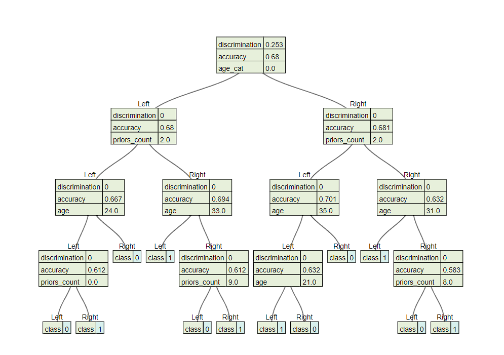
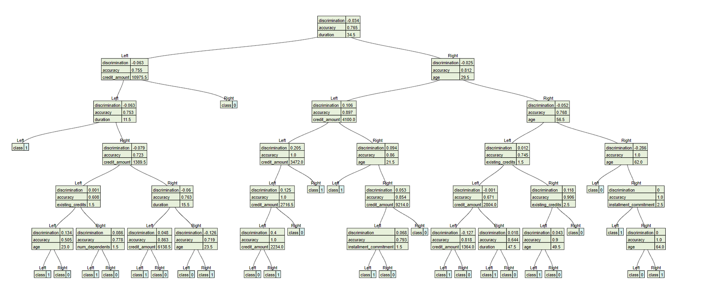

# Meta Analysis of Fair Retraining of Decision Trees

By default we use Statistical Parity and Equalized Odds to get discrimination and a depth of 4

## Compas Dataset Sex/Race Discrimination

> By default there is positive discrimination, so there is no need for the algorithm. With a target of -0.05 *worst node* method didn't change anything. Using *get bad nodes child* method the discrimination got worse from 0.27 -> 0.25 and accuracy stayed about the same. Sex and Race had the same results at depth 4.

### Default Sex/Race Discrimination

### Child Method Sex/Race Discrimination

## Compas Dataset Sex/Race Discrimination

> Depth of 6 resulted in a positive discrimination but had a handful of nodes that said females had would not recidivate and males would (which had a negative discrimination). Running through either method didn't make a difference

### Child Method Sex/Race Discrimination

## Adult Dataset Sex Discrimination

> The default tree had a negative discrimination of -0.205 and both methods resulted in the same result of -0.041 with accuracy dropping by 0.022. The *worst* method adjusted a bad node using sex and it's parent, the parent barely changed from 29.5 -> 28 age, while the the bad node was completely changed. It also changed another node from capital-gain and age to hours-per-week and education. This second change only saw a minor change in discrimination. 

### Default Sex Discrimination (2.0s)

### Retrained Sex Discrimination (Worst 12.5s, Child 9.0s)

### Depth of 6

> Changing the tree to depth of 6 had a similar discrimination of -0.198 and the *worst* node improved it to -0.51 with accuracy decreasing by 0.027. This method changed a node from capital loss to hours-per-week and from capital-loss to age. Additionally, it didn't alter the node that contained sex with a discrimination of -0.019. it made a large change shown here: (class 0 is cut off on the right)

> There was also a big change from a narrow path containing sex to a much shorter tree with a lot worse accuracy but significant improvements to discrimination which can be seen here: 

### Default Sex Discrimination Depth 6 (5.0s)

### Worst Method Sex Discrimination (16.5s)

### Child Method

> Using *child* method with default target barely effected the tree only changing much of the tree and not affecting discrimination or accuracy. This is because the discrimination at the root was worse than it's two children. This is caused by equalized odds/statistical parity not being consistent when combining data together. Manually setting the target to -0.05 didn't change anything either. This can be seen in this example here:

> If we change the discrimination function to just statistical parity we get the same result. Aggregation issues breaks both methods as *child* breaks as it recurses through the tree to find the root of the cause while the *worst* node breaks if the root is the worst node (or if the worst nodes is at the top)

## German Dataset Sex Depth of 6

> The German dataset by default had a discrimination of -0.126 and was improved to -0.034 by *worst* method with a decrease in accuracy of 0.01. It was able to do this by only retraining a singleton sex node and turning it into an age node. On the other hand, the *child* method got discrimination to a positive 0.048 with accuracy only decreasing by 0.005 meaning this method not only increased discrimination by more but also decreased accuracy less. It did this by retraining the 4th parent of the worse node. It also retrained a singleton node changing it from credit ammount to being a straight leaf predicting bad credit.

### Default Sex Discrimination Depth 6 (2.6s)

### Worst Method Sex Discrimination Depth 6 (0.2s)

### Child Method Sex Discrimination Depth 6 (2.7s)

## Entropy vs Gini

